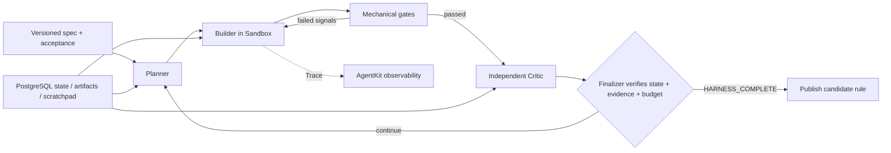

# AgentKit 混合云 Agent Harness 最佳实践

## 目标

本样例从已验证的企业客服 Agent 出发，展示更完整的 **Harness Engineering**：工程师把意图、约束、智能体可读环境、反馈回路、持久状态和完成条件做成系统，让 Agent 能自主、可恢复、可验证地交付一项客服规则变更。`harness.py` 的身份、工具和输出治理只是底层安全边界；Ralph 风格的核心交付循环在 `engineering_harness.py`。



## Harness 核心落点

- 仓库/状态库即记录系统：任务、验收标准、passes、反馈和候选工件都可重新读取。
- 地图而非手册：小型 `AGENTS.md` 指向 SPEC、测试和实现，按需披露上下文。
- Fresh context：每轮从权威工件恢复，不依赖无限增长的模型聊天历史。
- 角色循环：Planner、Builder、Critic、Finalizer 职责分离；Builder 不能自证完成。
- 机械背压：测试、schema、lint 和 Code Evaluator 返回失败信号，不用超长 Prompt 规定修复步骤。
- Disk is state：运行状态、候选工件和反馈跨轮持久化，Runtime 重启后可以恢复。
- 完成承诺：只有所有 story、独立 Critic 和预算检查同时通过才发出 `HARNESS_COMPLETE`。
- 熵管理：版本化评测、Trace 与定期检查持续发现规范和 Skill 漂移。
- 混合云落点：Runtime 承载循环，PostgreSQL 保存 run 状态，Sandbox 修改和测试候选工件，Skills 提供角色说明，云搜索只接收 Finalizer 通过后的 Knowledge 版本，MEM0 只沉淀已验证经验。

完整的 Ralph → 客服规则变更 → AgentKit 混合云组件映射见 [Ralph Harness 思路在混合云客服中的实现](docs/ralph_customer_service_mapping.md)。参考概念来自 [deusyu/harness-engineering](https://github.com/deusyu/harness-engineering)，实践结构参考其 [Ralph Demo](https://github.com/deusyu/harness-engineering/tree/main/practice/01-ralph-demo)。

## 底层 Runtime 安全边界

- 身份不进 Prompt：绑定网关校验后的 tenant/user/session 上下文。
- 策略先于 Agent：先把全局 allowlist 收敛为当前路由的能力集合和预算，再执行业务核心。
- 业务与治理分层：`harness.py` 包装 `demo_core.py`，跨切面逻辑不散落到每个工具。
- 执行证明逐次核验：不对工具名去重；未知工具、跨路由工具或超预算都会 fail closed。
- 输出契约：返回前检查回答大小、引用结构、安全状态与工具门禁结果。
- 真正递归脱敏：回答、引用和事件 detail 中的 Authorization、JWT、API Key、AK/SK 在导出前被替换，并记录脱敏计数。
- HTTP 之外仍有边界：直接 Python 调用同样执行消息长度、租户、用户、会话和身份来源校验。

完整代码解读见 [Agent Harness 开发指南](docs/agent_harness.md)。

## 关键目录

```text
hybrid_cloud_agent_harness/
├── engineering_harness.py   # Planner/Builder/Critic/Finalizer 自主交付循环
├── harness.py               # 请求包络、策略、注册表、预算与输出校验
├── demo_core.py             # 已验证的客服业务 Agent
├── examples/customer_policy_change/ # SPEC、AGENTS.md 与机械验收工件
├── agent.py                 # VeADK + AgentKit Runtime 入口
├── demo_app.py              # 无云凭据的确定性本地 HTTP 服务
├── local_ui.py              # 本地 BFF，Runtime Key 不进入浏览器
├── web/                     # Harness 架构说明与 harness.* 事件面板
├── evaluation/              # 评测集、LLM/Code 评估器样例
├── tests/                   # 原业务回归测试 + Harness 契约测试
├── docs/runtime_deployment.md
├── Dockerfile
└── entrypoint.sh
```

## 本地验证

```bash
cd python/02-use-cases/hybrid_cloud_agent_harness
uv venv --python 3.12
source .venv/bin/activate
uv sync --frozen --extra dev
uv run --frozen ruff check .
uv run --frozen pytest -q
DEMO_MODE=demo uv run --frozen python client.py
./scripts/run_local_ui.sh
```

浏览器打开 `http://127.0.0.1:8000`，默认进入 Harness 专属建设路线：身份边界、策略编译、受控执行、工具证明、输出脱敏和发布门禁。点击页面右上角或最后一步进入 `/chat` 交互式治理工作台，再运行 **Harness 验收**。右侧应依次出现 `request.accept`、`identity.bind`、`policy.precheck`、`route.select`、业务事件、`tools.authorize`、`output.validate` 与 `telemetry.export`。其中 `policy.precheck` 会显示路由级 allowlist，`tools.authorize` 会显示实际调用次数、预算和违规项，`telemetry.export` 会给出最终 allow/deny 决策与脱敏计数。

## 混合云部署与验证

首次部署只使用一个交互入口。它会复用或引导配置 AgentKit 控制面、要求人工确认
Region、隐藏读取模型 Key、运行测试、构建 `linux/amd64` 镜像并部署；任何凭据都不会
写入仓库文件。

```bash
./scripts/deploy_interactive.sh
```

完整原理、人工操作点和发布验收见
[智能体运行时部署文档](docs/runtime_deployment.md)。Registry 临时令牌有有效期；
出现 `token expired` 或 `unauthorized` 时，需要在控制台重新获取临时登录命令，
手动执行 `docker login`，再重新运行部署入口。

在 Runtime **高级配置 → 观测服务**勾选**启用**并重新发布，然后按以下顺序验收：

1. API Key 和 OAuth JWT 分别调用公开 `POST /invoke`，确认 user/session 来自网关覆盖后的请求头、tenant 来自网关头或受信部署变量 `HARNESS_TENANT_ID`，而不是 Prompt。
2. 本地 UI 核对 `harness.*` 事件、允许的工具名称、预算结果和输出校验。
3. 平台 **可观测 → Trace 分析**核对 Agent、Workflow、模型、Token、工具和耗时 Span。
4. 发送提示词注入样例，确认业务安全事件为 blocked，Harness 仍完成输出校验和脱敏 Trace。
5. 断开某个工具组件重新发布，确认 Harness 不会伪造工具成功。
6. 使用 `tests/test_harness.py` 中的未知工具、重复超预算、跨路由调用与泄密桩验证 fail-closed；这些反例不依赖云资源，可作为发布前门禁。

## 配置与安全

真实模型 Key、Runtime API Key、OAuth JWT、AK/SK、内部域名和平台注入凭据只能通过环境变量或平台组件关联提供。仓库中的 `.env.example`、`agentkit.yaml.example` 和命令均只保留占位符。
